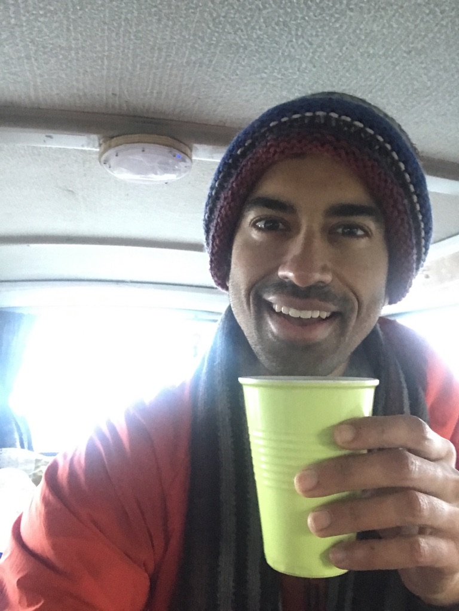

Yeesh I nearly vomited in my mouth as I typed that title...

With less than 4 weeks left before my first day at my new job, it was time to put my boy Garth to the test! So within a couple days of leaving quarantine, I was on my way to my first stop, Wellington. Wellington is located at the very southern tip of the north island and is where the ferry to the South Island departs from. My journey was filled with a lot of firsts. For one, I had never lived in a van before. Would I enjoy this experience or would I learn that vanlife is a sham? Is it easy to find places to park? What about bathrooms? I mean, the van has a chemical toilet in it, but I really don’t want to use it unless its a last-resort kind of thing. What about the gas stove? Where do I find LPG gas? Am I really going to be able to cook in this thing? Also, someone mentioned something about a dumping station? Is that just another term for toilet? … OHHH it seems that according to google, dumping stations are where one dumps out their gray water and fills up your clean water for the sink in their van. Ok Ok I got it… but how do I transfer the water over to the little tank under the sink?? Oooo there is little hose here in the van… maybe I connect it up to the pipe?? Ehhh.. I’ll just figure it out when the time comes. 

I managed to make it down to Wellington around 9pm that night. It was getting late and I needed to find a place to park the van and set up camp. The plan was to take the ferry over to the south island the next morning. Thankfully, finding a place to park turned out to be WAYYY easier than I had anticipated. I loosely remembered the French couple who sold me the van telling me about an app they used to find free and paid spots to camp and I was able to quickly find it with a couple google queries. The app’s name is CamperMate and OH MY GOD IT IS AMAZING!!! CamperMate is like NZ Camper’s Bible!!! It has info on EVERYTHING one would need to camp in New Zealand. It tells you about free and paid camping spots, locations of free wifi, water fountains, bathrooms, hot/cold showers etc. You can even download a searchable offline map, something that proved to be invaluable, especially in some of the remote areas with little or not cellphone reception. Using this, I was quickly able to find a free camping spot in the south of town which was just a 15 minute drive to the ferry. CamperMate should really be paying me for this wildly positive endorsement…. 

The camp itself was just a little parking lot with 2 public bathrooms. As I drove in, I noticed other campers parked in various spots. AH MY CAMPER HOMIIES!! WADDUPPPP!!! I tried nodding to some of the other campers like motorcyclists often do when they pass each other but nobody seemed to reciprocate. Either way, I was super excited to see other campers in the lot. It was fun thinking about which leg of their journey my fellow camper comrades were on. Some had probably just finished their south island adventure and had just taken the ferry over back to the north island that evening, while others, like myself were just getting started. There were campervans of all shapes and sizes. They ranged from tiny little Subaru’s with basically a mattress in the back to huge luxury vans that took up nearly 2 parking spots. Compared to the USA, it seems like there is a LOT more variety in terms of campers. The country is also very camper friendly. Another thing that stood out was the generational diversity at display. The age demographic ranged from backpackers in their 20s to middle aged families to retirees in their 70s. It was nice to see that campervan-ing was an activity that was accessible to almost anyone - rich or poor, young or old. 

It was getting late, and I needed to get to bed so I wake up in time to catch the ferry the next morning. It was getting colder as the night progressed. I speedily changed into some long underwear and buried myself under a couple blankets in the back of the the van while clinging to a hot-water bottle I had just warmed up. Here’s to hoping I don’t freeze to death in this beautiful little rust bucket. Cheers!

