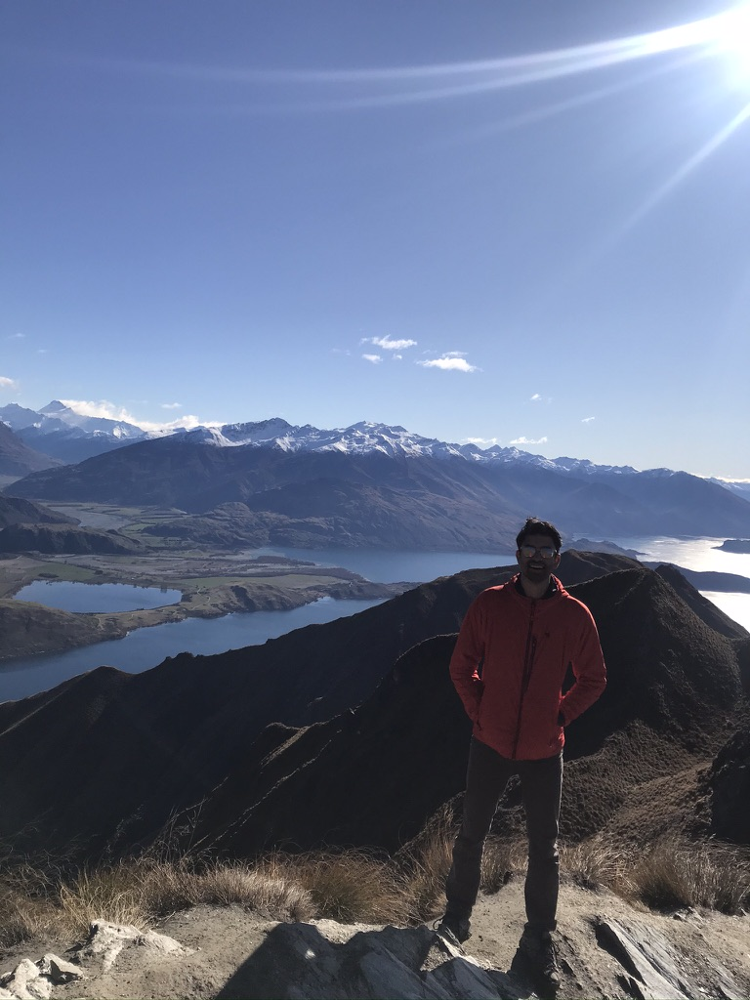

Well... by the time I realized it, it appears that my time in New Zealand has nearly come to an end!! 

By some miracle, I managed to time my stint in NZ quite perfectly. I arrived in NZ in late August, just as the second surge was starting to build. Meanwile, thanks to its giant moat and solid leadership, New Zealand has managed to remain largely covid free, allowing people here to live quite a normal life, which is something of a luxury these days. Life here, save for the lack of tourism, has been untouched by the effects of the COVID-19 pandemic, and has allowed me to take full advantage of my time in the country, while I'm not working that is.  

Speaking of work - I absolutely love my job. Work life in NZ is so incredibly different and immensely rewarding. For one, pts here tend to be very grateful for the care they recieve, and everyone has access to free healthcare (though some small copays exist). Comparetively in the US, patient, especially caucasian ones who are more well off, tend to be more demanding and dictate the care they recieve. In NZ, there also appears to be a baseline understanding that ones health and family life comes first, and their job second. Strong emphasis is placed on mental health, physical health and a good work-life balance. Resident physicans (known as registrars) can take months to years off at a time at any point in their training depending on their preference. They are afforded 30 days of paid vacation/year and face no reprocussions if they have to take time off an illness or need a "mental health day". If a shift needs to be filled, residents are even offered extra pay to come in to work!! CAN YOU BELIEVE IT??? And wait, there's MORE -  If residents work a holiday, not only do they get paid extra, they are also given a "lieu day" that they can claim at any time. Lieu days and holidays that aren't used are paid out to residents at the end of the year. Oh and did I meniton that residents here get paid over $100k/yr???? Yet somehow, folks here still seem to find things to complain about. If only they knew what it was like in the US. Back home, residents are often treated like indentured servants, and get paid only about $20/hr for keeping people and the hospital alive. One literally has to be bleeding out of their eyes to call in sick, as doing so will force one of their collegues to be called in on what could sometimes be their only day off. And getting paid extra for working overtime - hahaha good one. Unlike the US, where doctors are forced to put their social life on hold during their training, residents here can afford to continue to have a balanced and fulfilling social life during their training years. THey can have relationships, pursue hobbies and even have kids (both parents can get up to 6 months of PAID maternity/paternity leave). Maybe there IS a better way to train future physicans without burning them out before they enter the workforse. Now... all this being said, looking back, I still had a great time in residency. Was it tough ? Hell yeah. But thats life, and I'm glad I went through it and came out resilient AF on the other end!! 

Through work, I've also had the opportunity to make some new friends. While the consultants are a bit on the older side and are largely resigned to family life, the residents tend to be a much more social bunch. Many of the trainees here appear to be from England. Apparently residents from England can do a part of their training in NZ and many take advantage of the opportunity. A large chunk even decide to finish their training in NZ and become permanent residents (apaprently the NHS isn't very well liked by physicans and patients alike.) One thing I was surprised learn was that physicans in NZ get paid more than those in the UK, which is saying something cuz the pay in NZ is nearly 1/3 of what we get paid in the US. A majority of my friends here are other residents, though I have made some friends outside of the medical community as well.While it has taken some time, I have also started to finally feel like I am a part of a community here in Hawke's Bay and have developed a circle of reliable friends. The unfortunate bummer is that just as I am starting to feel comfortable here, my time in NZ is coming to an end. But alas, such is life. 

In between work and spending time with friends, I've also been able to do a ton of travelling, thanks to Garth, my trusty steed/campervan. From Invercargil all the way to Cape Reinga, I've managed to traverse nearly every little corner of the country. The only place I wasn't able to see on my list (because my trip got rained out) was Mt. Taranaki. NZ is so incrediby beautiful, and the lack of tourists here due to the travel restrictions in place has been a huge bonus for me (though I can't say tbe same for the tourism industry). My time here has been a once in a lifetime experience - void of other tourists and crowds. I don't think I will ever get an opportunity like this again! It has truely been such a wonderfully special time being here. 

While 2020 and 2021 will be remembered by many as the year of the coronavirus and social distancing, I will forever remember it as the year I had an adventure of a lifetime in Aotearoa - The land of the long white cloud.  

Now here is a random smattering of pics over the last year. More to come in a future blog post!

