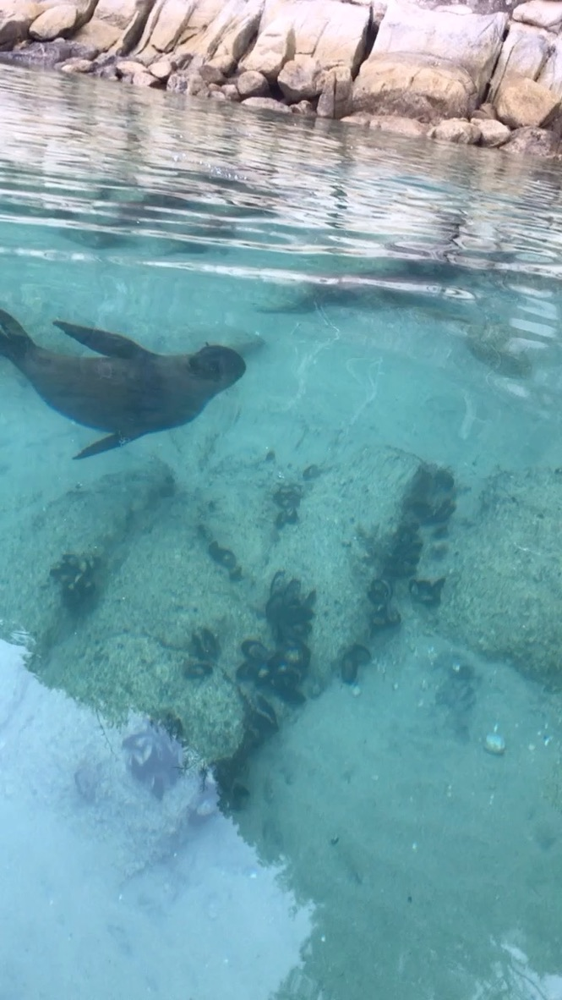

Next up, Abel Tasman National Park. 

This place came highly recommended by Gabe Wardi, who had visited the country just a couple years before. And boy did it not disappoint. Located at the northwest end of the South Island, Abel Tasman National Park is a lush, green bay surrounded by beautifully calm and serene waters with little islands dotting the coastline. Thanks to COVID-19 and the lack of tourists, I had what many would describe as a once in a lifetime experience being the ONLY tourist that day in Abel Tasman ( I would later find out that there were actually a couple other tourists but they were already away on a several day backpacking journey deep in the forest when I arrived). I drove into Maharu, the last little town at the very tip of the forest to find eerie silence and a majority of the stores shuttered. To my relief, there was one kayak adventure store still open. With their help, I was able to get a guide who agreed to take me me kayaking in the park. 

My kayaking companion and guide was Jessica O’Conner, who I’d later learn was a celebrity of sorts. But more on that in a bit. We pack our gear and our lunches and make our way to the boat dock where we begin our little half day expedition along the outer edges of the park. I sat in the front of the kayak while Jessica helped steer us from behind. As the town of Maharu got further and further from us, the beauty of Able Tasman began to really reveal itself. Holy moly it was like something out of a movie. The sky was bright blue and reflected against the crystal clear waters of the bay. The water was so translucent that you could see nearly see the bottom. But what made the experience particularly memorable was the fact that we were literally the only people on the water that day, something Jessica pointed out almost never happened. Normally, the guided tours would comprise of 15-20 kayaks (especially in the busy summers) but the off-season and COVID had nearly wiped out the tourist economy.

We paddled our way along the shore and found an isolated beach on which to have a lunch break. Jessica and I got to talking about covid etc., and she learns that I just recently moved here from the US. We got to chatting about the quarantine process when she mentions that her brother, who was in the UK also recently got out of quarantine. This is where the story takes a turn! The convo goes something like this: 

Me: “ So, did your brother come back to escape COVID?”
Jessica: “ Um… not really. He actually back because of me” 
Me: “ ???” 
Jessica: “ Well you see, I had gone on this bushwalking trip with a mate and we ended up  getting lost for almost 3 weeks” 
Me: “ wait…. WHAT??” 

Once I got past the kiwi lingo ( apparently bushwalking is synonymous with backpacking) , I learned that Jessica and a friend of hers had gone back packing in a nearby national park through some unmarked territory and ended up getting lost due to fog. By day 8 of what was supposed to be a 4 day trip, the duo was completely out of food, but managed to find a creek to obtain fresh water. With their energy nearly depleted and no way to make it out, they decided to stay put near the creek so that they could at least have access to water while they waited to be rescued. I asked Jessica whether she ever worried about whether the rescuers would find her in time. She mentioned that the hardest part about the entire experience was in fact not the lack or food or the prospect of not being rescued. She could hear helicopters during the day time looking for them and was convinced that they would be found. What Jessica found truly challenging was dealing with her backpacking partner/friend. As they got desperate, her relationship with her friend had started to fray and emotions flared. The friend was convinced that they need to keep moving. However, being an experienced backpacker, Jessica knew that their best chances of being rescued laid in conserving their energy and staying by the creek till they were rescued. Convincing her partner of the same ended up being an incredibly challenging endeavor and a traumatizing experience. Thankfully, they managed to stay put and were miraculously found by a search and rescue team after 19 days out in the woods!! 19 days!! I can barely go 6 hours without food… I asked Jessica if she would ever do a backpacking trip in the backcountry again. To which she goes “ I learned my lesson, I got to bring a satellite phone with me next time!”. What a BOSS!

With my mind still fixated on the insane story I had just heard, we set out again on our kayaking journey. I found myself thinking about whether I would’ve survived if I had been lost for 19 days (I would’ve died for sure), but was soon distracted by the little pod of baby seals that swam towards the kayak. They were so adorable looking and incredibly curious. They followed our kayak and played around with us, doing little zoomies back and forth under us in the clear blue water. It as sooo cool!! Def one of the highlights of the trip by far!! 

We eventually made it back to the dock just as the rain set in. Perfect timing and a perfect way to end what will definitely be one of the most memorable days of my life. 

Definitely need to come back here again! 

Here is a link to the news story on Jessica’s [rescue](https://bit.ly/30XWH2A) in case you are curious.