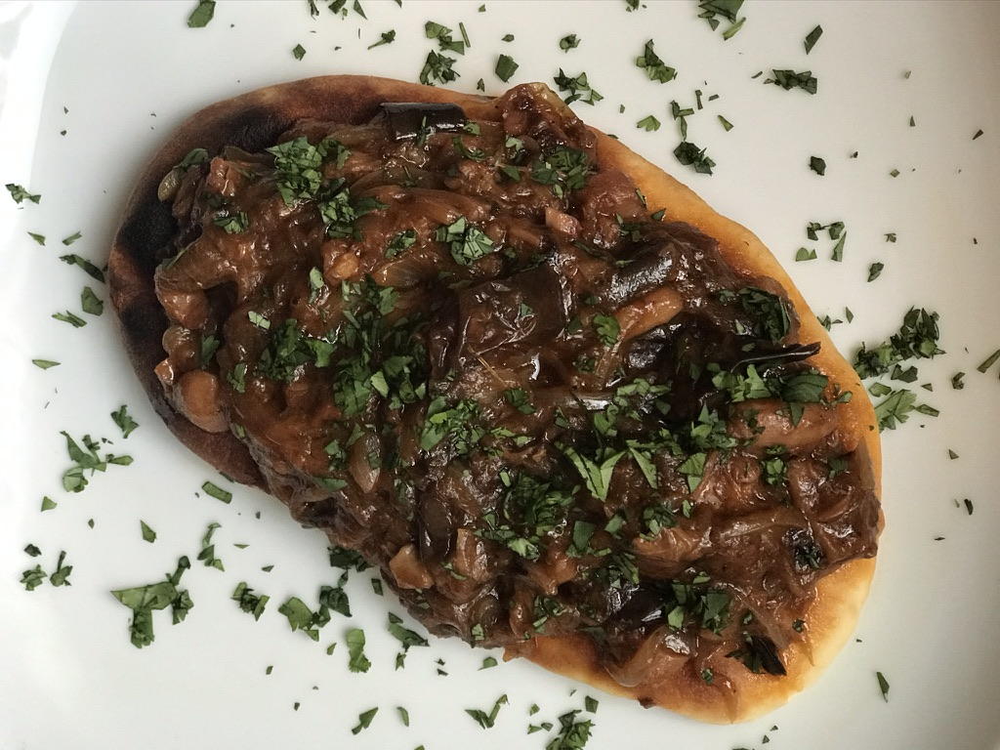

Matt and I made a SUPER DOPE BBQ Jackfruit sandwich today. It came out absolutely delicious!! To quote Matt, "I would not have known this wasn't pork if nobody had told me".

I remember the first time I had a BBQ Jackfruit sandwich. It was at a this vegan death-metal themed hipster restaurant called "Kindred" in South Park, SD. I remember it be so incredibly delicious. There are few dishes that I have that make me go "OH MY GOD THIS IS LEGIT GOOD". This was definitely one of them. Thats when I got into the idea of making a bbq jackfruit sandwich. It also defintely helped that jackfruit as an ingredient is now so ubiquitously available that it was super easy to procure

The recipe I used can be found [here](https://chowvegan.com/2008/05/28/bbq-pulled-jackfruit-sandwich/?utm_campaign=yummly&utm_medium=yummly&utm_source=yummly)

Here is the recipe (we tweaked a few things)

### Ingredients 
1. Can of Jackfruit with brine (20 oz)
2. 1/2 Onion
3. 2 small eggplants
4. 2 cloves of garlic (smashed)
5. Phills BBQ Sauce 
6. Naan Bread (from TJs)
5. Red Cabbage/Cole slaw 
7. Eggs 

### Recipe

So we basically took a pressure cooker, cooked the onion in it with garlic, threw the jackfruit in there along with cut upp eggplant and BBQ sauce. I added some water to cover the veggies and pressure cooked the crap out of it to the point where it all because fairely mushy. You can then take the jackfruit and shred it with a fork to make it look like pulled pork. 

We also toasted some naan in the oven, putt the BBQ jackfruit on and topped it off with some red cabbage. I'd also highly recommend adding an over medium egg to it as well if you want!

There you have it! WHAPAW BBQ JACKfruit Sandwich me laddies! 

