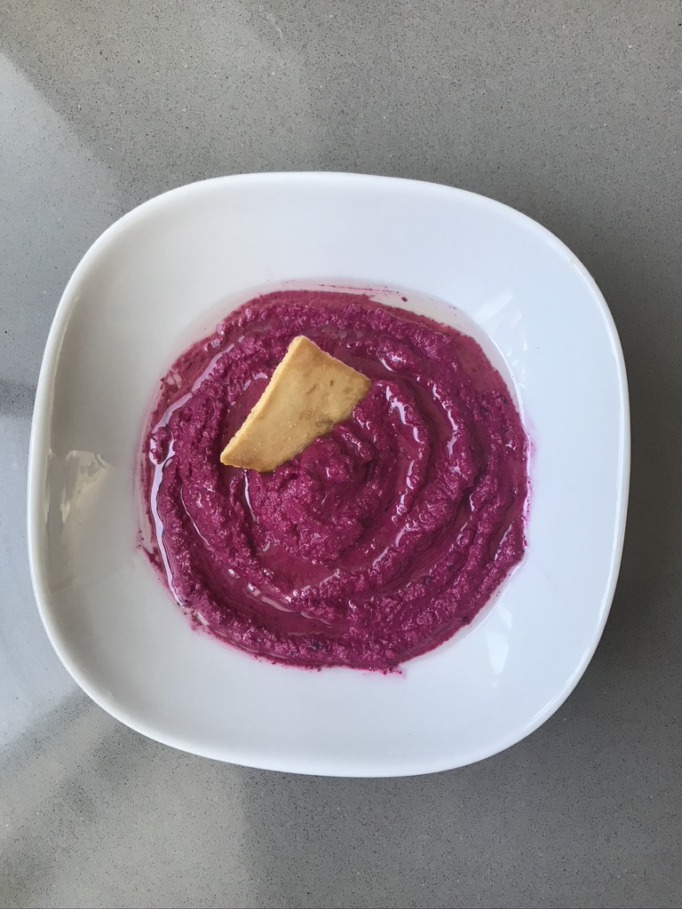
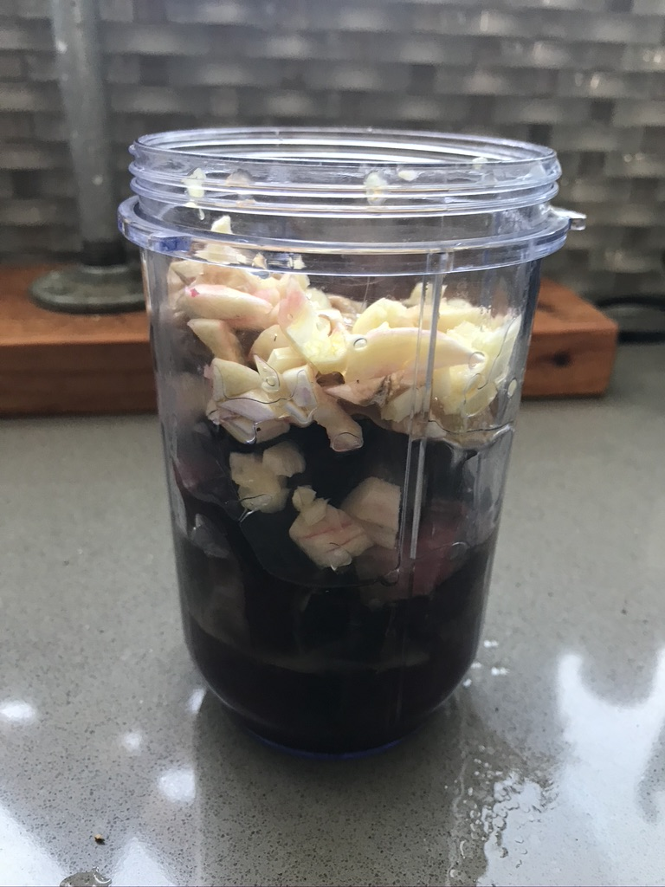
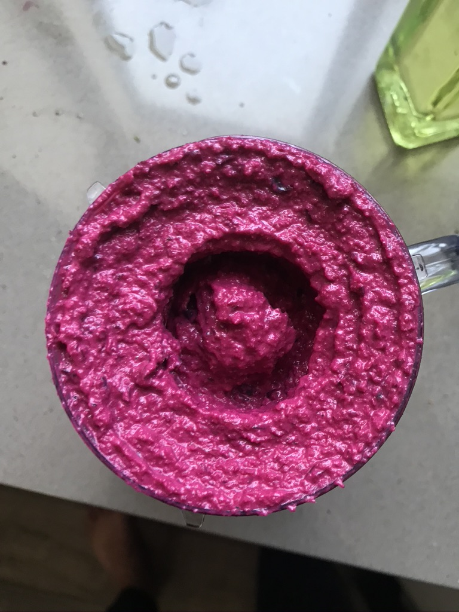

Matt grew some beets in his garden. Dude I did not realize how small organically grown beets are relative to the behemoths that we see at the grocery store! These were tiny and cute and surprisingly small for the large leaves they produced. Wish I had taken a picture of the beets themselves because they were adorable. Now ON TO THE RECIPE.

Three little beats isn’t a lot so I decided the best thing to make with them would be beet hummus! There were also recipes for beet and potato/quinoa burger patties but that seemed really involved so beet hummus it was! 

The recipe I used can be found [here](http://notwithoutsalt.com/beet-hummus-and-a-chance-to-win-some-crazy-cool-chico-bags/?utm_campaign=yummly&utm_medium=yummly&utm_source=yummly)

### Ingredients: 
1. 3 Medium sized beets
2. 1 clove garlic (I used 2 large cloves and it was SUPER garlic-y but I like it that way)
3. 2 tbsp tahini
4. 1/4 cup olive oil
5. 1/4 cup lemon juice 

### Recipe: 
* Roast the beets at 375 degrees in the oven till they are soft and easily penetrated by a knife
* Chop up everything and throw all ingredients into a food processor (I used a magic bullet and it worked just fine) 
* THATS IT - TAADAAAAAAA!!!

