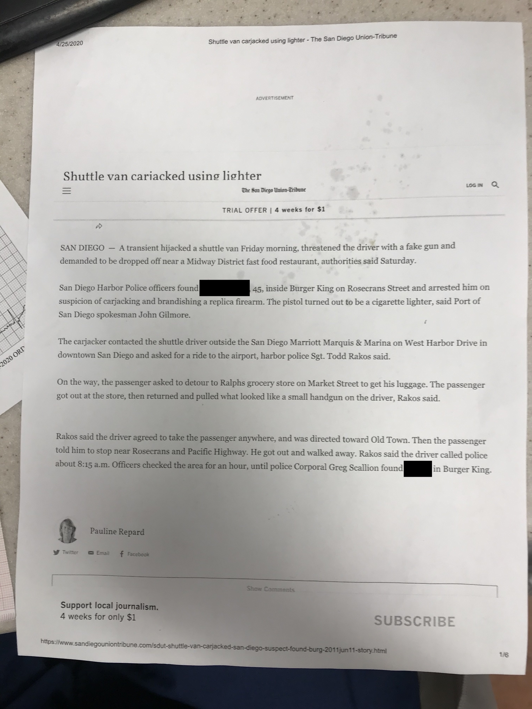

We are now over 4 weeks into the lockdown and the curve appears to be flattening. They're talking about opening up parks and beaches again. I head into my 2pm Saturday shift at hillcrest expecting the ER to be empty as it has been for the past couple weeks. Instead I walk in to a resident intubating a patient in bed 6. 4 gurneys line the ambulance bay awaiting to be triaged into rooms. Its noisy. Today feels like a real ER day. I look at one of the gurneys and immediately recoganize one of the patients. Ah our drunken frequent flyer CB is back! Bro I thought you had died! I never thought I'd say this, but I actually missed your drunk belligerent ass. Welcome back my friend. Lets get you into room 16A and go through our little dance like we always we always do.

Meanwhile Billy, our case manager comes to me and goes, "you know he's a celebrity right?" and hands me this: 

So apparently, 9 years ago, our boy CB highjacked an airport shuttle using a gun (which turned out to be a cigarette lighter) and forced the driver to take him to Burger King where he was later found by police enjoying what I assume to be a whopper. WHAT A LEGEND! 

You do it your way Collin!

*Some names and identifying details have been changed to protect the privacy of individuals. Any resemblance to actual persons, living or dead, or actual events is purely coincidental.*