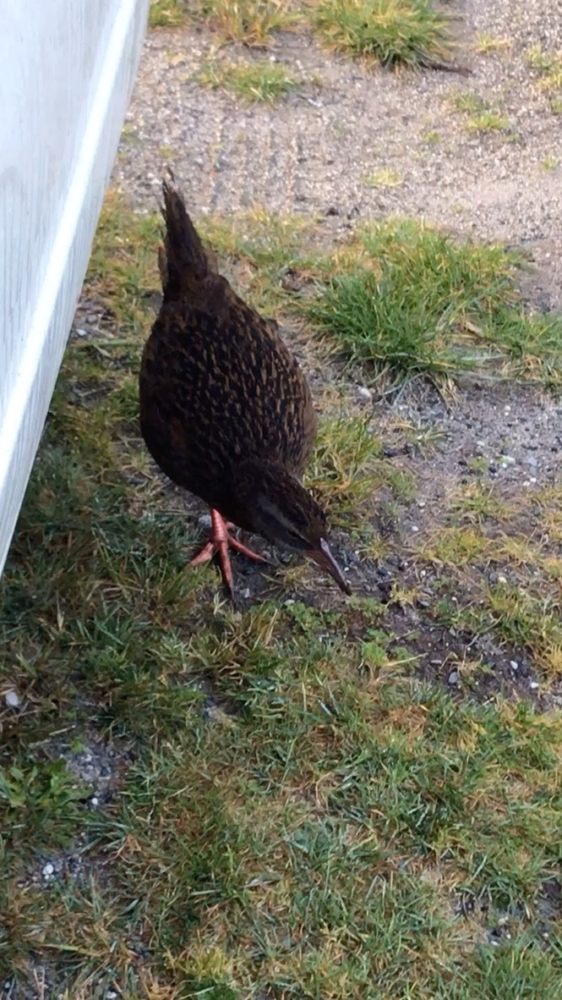
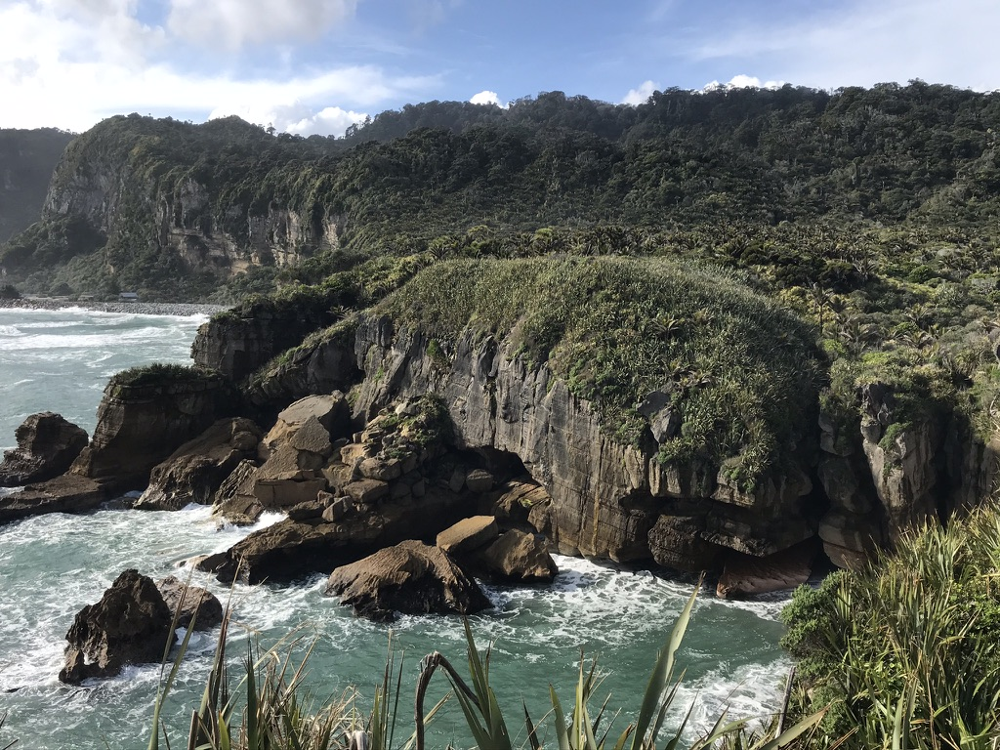
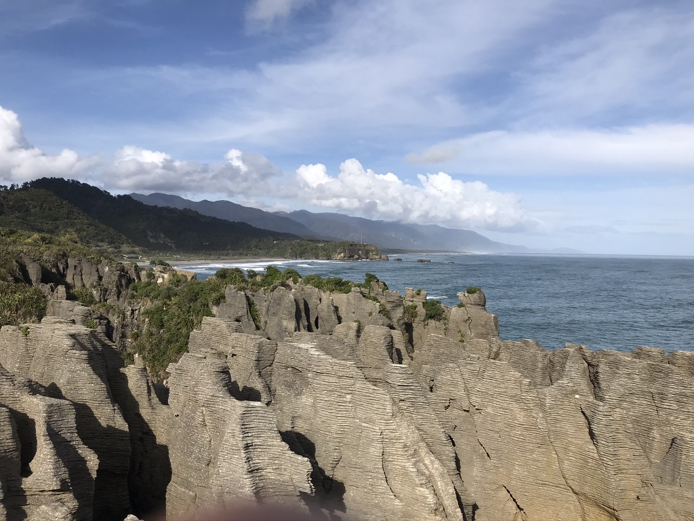
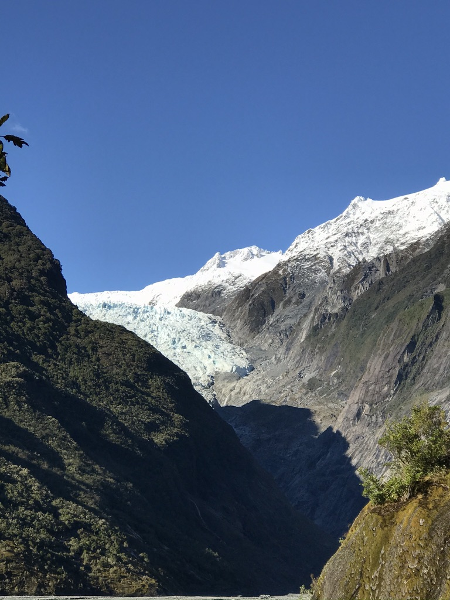
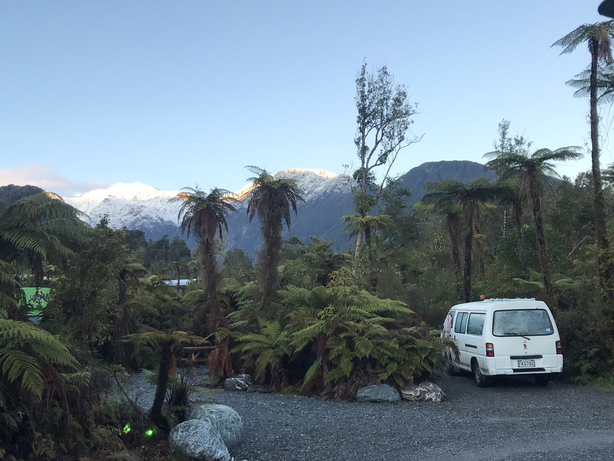

Leaving Able Tasman, I meandered down the beautiful west coast and got to my next camping spot. The camp was a beautiful little patch of grass nestled between a large rock face and the beach. As I park my car and got out, I notice this little interesting looking bird curiously come up to the car and poke around. I think to myself, "IS THIS THE FABELED KIWI BIRD?? It has to BE!". I spent the next 10 mins trying to get a picture of the bird. I would later show this picture to a friend only to be told that the bird definitely was not a kiwi, but a common native chicken equavelent. 

The next morning, I stopped by the fabled Pancake Rocks for a quick snack and slowly made my way down the winding roads of the west coast. The farther south I went, the crazier the landscape got. From mile to mile, the terrain shifted dramatically. One second you are driving through what feels like a rainforest with rain pouring down on you. The next second BAM you are sandwiched between a sheer vertical rock face on one end and the beach on the other. Its just amazing how crazy beautiful the drive down the South Island is, and nowhere exemplifies this more than the west coast alongside the Franz and Fox Joseph Glaciers. 

Both glaciers were hyped AF on all the guides I had read but tbh I was a bit underhlemed when I actually saw the glaciers. The problem is, the Franz Joseph Glacier is no longer the majestic glacier that it once was. Over the past few decades, thanks to global warming and other contributing factors, the glacier has rapidly retreated backwards and no longer flows into the ocean like it once used to. Just 10 years ago, one used to be able to hike right onto the glaciers. Today, the hike to the glaciers ends at a viewpoint that allows you to see just the receding tip of the glacier from afar. The only way one can get on the glacier these days is by doing a “heli-hike”, where you are flown by the helicopter onto the glacier for ~ $300/person.  PASS! 

Nonetheless, I was still happy to be able to see my first ever glacier, even if it was from far away. With the main hike to the glacier no longer available, I found another hike that wound up the mountain adjacent to Franz Joseph glacier and enjoyed exploring it. Though I did have to turn around before I got to the very end because 1. The hike started getting a bit sketch and 2. The sun was about to set soon and  getting back would’ve been perilous in the dark. All in all, Franz Joseph still offered some stunning views of the snow capped peaks of the southern alps juxtapositioned next to some gorgeous beaches. 

