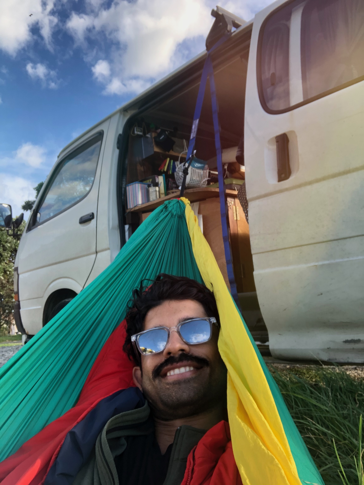

I recently listened to an interesting episode of the Freakenomics podcast. This episode was about "Fresh Starts". In it, Steven Dubner interviews researchers who try to answer questions like -  "Do fresh starts lead to lasting change in someones behavior? Do people who are generally doing well do worse if they have a sudden change in setting and visa versa?" The general consensus based on the research seems to be that fresh starts that change up your regular routine, whether by choice, force or circumstance can lead to lasting long term changes in one's behavior. The mindset/ psychological shift that comes with say, moving to a new city/ country, starting a new job, or going into lock down due to a pandemic, can create an environment where one can allow themselves to break free of some old habits and start cementing new ones - a psychological fresh slate if you will. Somehow, everything before the change occurs no longer matters anymore. The mental barriers to change shrink. 

Much of this theory rings true with how I've changed through my life. I have noticed that every  transition I have gone through has served as a catalyst for one type of change or another, and almost always a positive one at that. The transition from medical school to residency brought  with it new found interest in woodworking and experimenting more with my creative side. Similarly, the culmination of previous romantic relationships has historically served as a powerful catalyst for self reflection and personal development. 

There is something about a change in one's setting or routine that drives a person to shift something within themselves as well.  It is why I enjoy such transitions so much - it gives me the fresh slate and springboard I need to try something new or different. It gets me thinking about how I want to change, grow and improve.

 As I finish my time here in New Zealand and start to make plans for my return to the San Fransisco Bay Area, I have begun to think about how I would like to take advantage of this upcoming transition to continue my growth. How do I want my work/life balance to look like over the next few years? What relationships do I want to prioritize? Are there new hobbies I want to pursue? Are there old hobbies/ interests I want to rekindle? What new/healthy habits I want to develop. 

LEZZZ GOOOO! 

