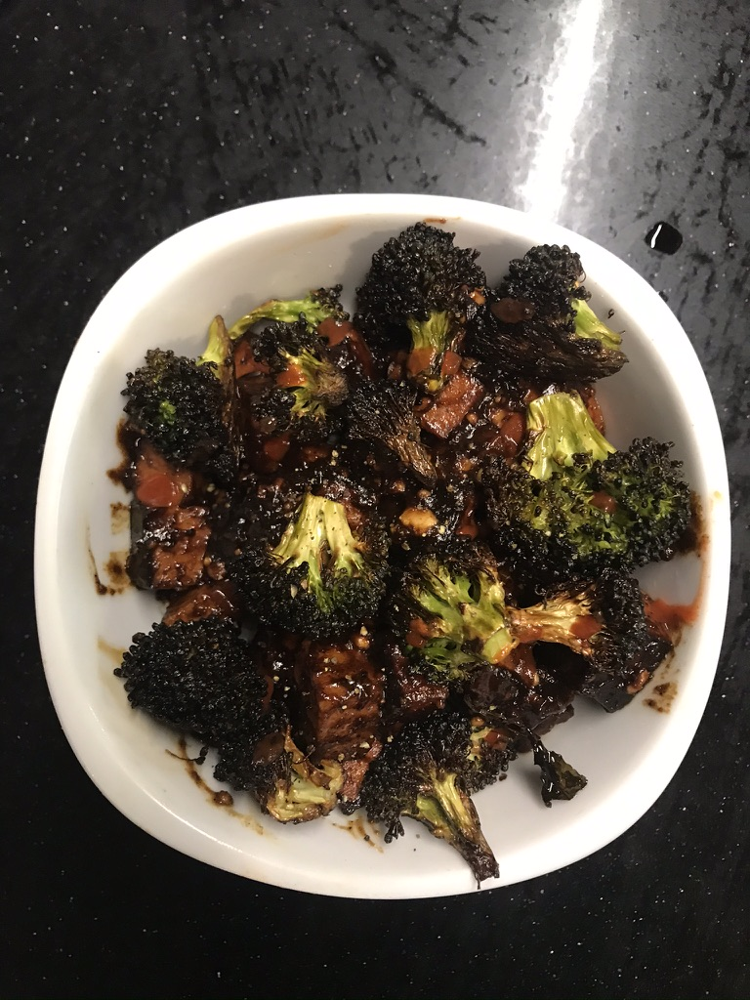

BOOYA CHEF VISHNU IS BAACKK!! Well.. tbh I wasn't really on a hiatus. In fact, since moving to New Zealand and quickly realizing that eating out here is anything but cheap, I've been really putting more effort into cooking for for myself on a regular basis and have really grown to enjoy evenings where I get to make a nice homecooked meal. Nothing tastes better than the satisfaction of knowning that the super delish meal you just bit into was made by your own two hands! Today's recipe is another yummly find - the Asian Peanut Garlic Tofu! 

The recipe I used can be found [here](https://spicysouthernkitchen.com/asian-garlic-tofu/?utm_campaign=yummly&utm_medium=yummly&utm_source=yummly)

### Ingredients: 
1. 1 package super firm tofu
2. 1/4 cup Hoisin sauce
3. 2 tablespoons soy sauce
4. 1 teaspoon sugar
5. 1 teaspoon freshly grated ginger
6. 2 cloves garlic, minced
7. 1/4 teaspoon red pepper flakes
8. 1 tablespoon olive oil
9. 1 teaspoon sesame oil
10. Peanut butter (optional)
10. green onions for garnish
11. rice for serving

### Recipe: 
* In a medium bowl, stir together Hoisin sauce, soy sauce, sugar, ginger, garlic, and red pepper flakes.
* Cut tofu into bite-sized pieces (tofu is ideally already dried but it doesn't really matter that much). Place in bowl with sauce and toss to coat. Let sit 30 minutes.
* Heat the oven to 400F, cut up some brocolli into bite sizes pieces and roast for about 15 mins
* Heat olive oil in a pan over medium heat. Once warm, add tofu. Cook all sides of the tofu. Now at this point the dish was less saucy than I would've liked, so I doubled up the sauce I'd made earlier and threw it in there. Also, being the huge peanut butter aficionado that I am, I decided last minute to also add a large wallop of penut butter to the mix. 
* Drizzle with sesame oil and remove from heat.
* Add the brocolli and sprinkle with green onions and serve with rice.

 ### MMMMMMMMMM TASTES SOOO GOOOOOOOODDDD
