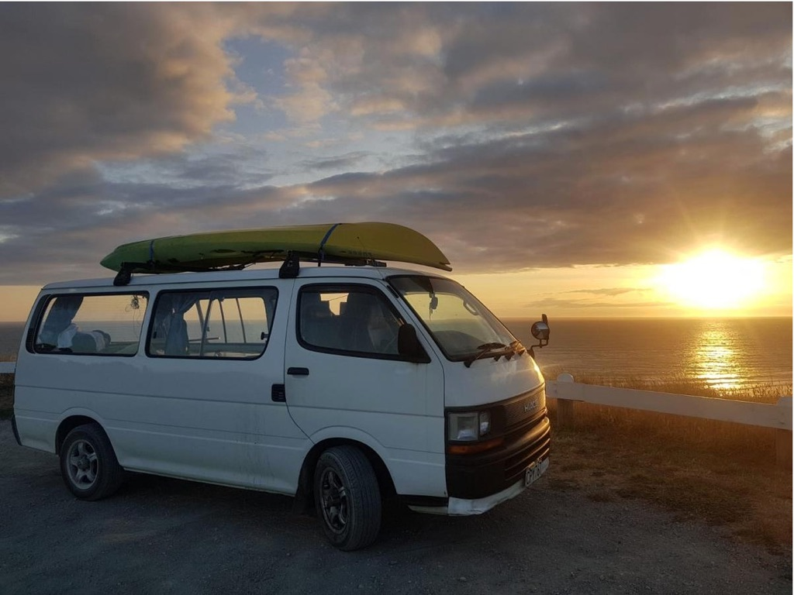
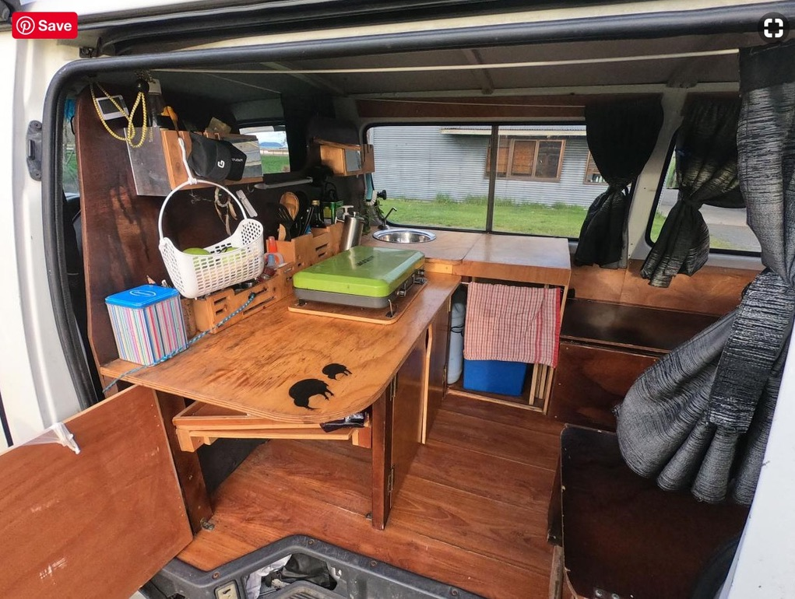
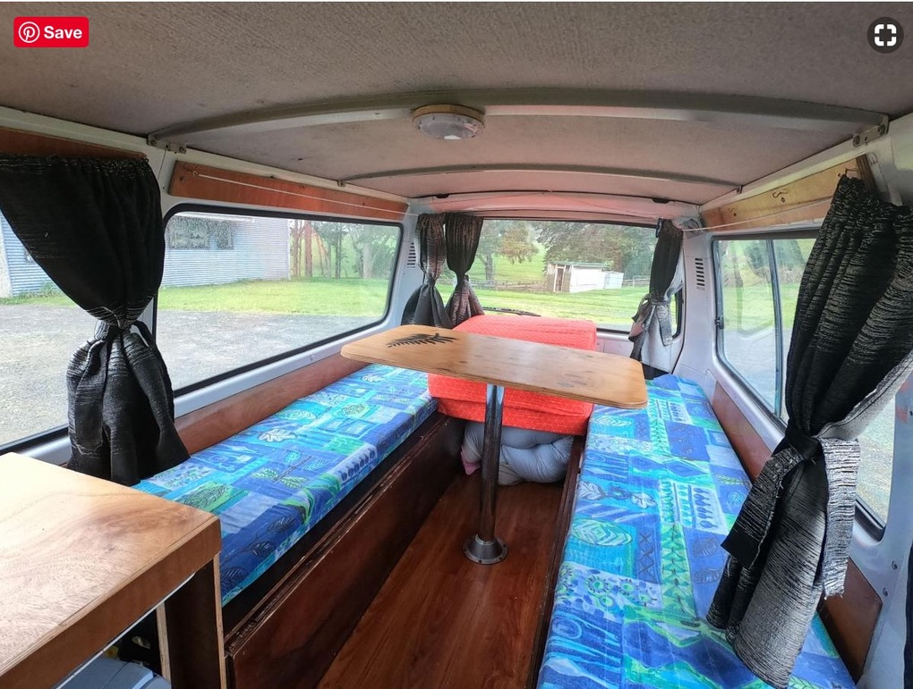
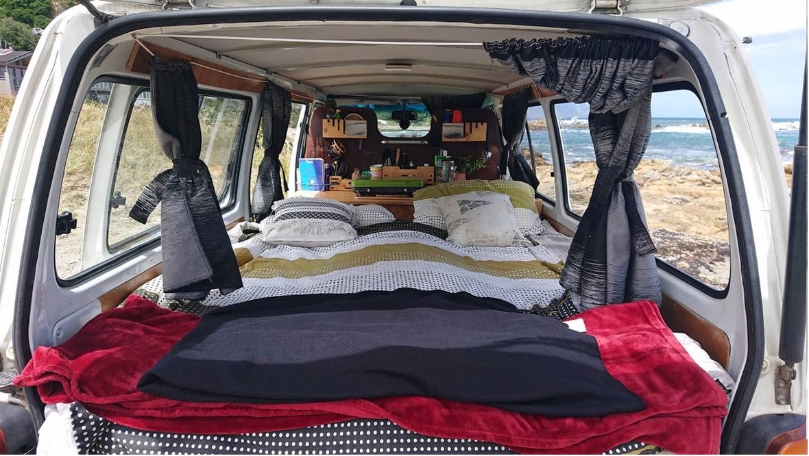

Having a little campervan of my own that I could travel in has always been a dream of mine. But you know, like many dreams.. it was just that.. a DREAM.  Fast forward to August of 2020 and here I am in New Zealand of all places, and have just bought this old ass campervan from two French backpackers. I’m not even sure how the idea of buying a campervan in NZ came about, but once it did, it couldn’t get it out of my head.

It turns out that traveling in a camper van is actually a thing in New Zealand. Every year, hordes of young people in their 20s (primarily from Europe) travel to New Zealand and spend the better part of a year WOOFing around the country. Yes you heard that right… WOOFing. It apparently stands for World Wide Opportunities on Organic Farms. Basically its modern day indentured servitude for white vegans -  where people in their 20s get work/vacation visas to work on organic farms in exchange for free boarding. Many of these folks buy campervans to travel around the country in between gigs. The vans themselves are often old white cargo vans like Toyota Hiaces or Mazda Bongost that are converted into campers. Every year, these vans are passed down from one owner to the next as new WOOFers arrive to replace the one leaving. With each new owner, the vans get quirky little modifications and grow to develop their own little personalities. 

By the time I inherited Garth, he had already been around the block a few times. I ended up buying him from a French couple who had been WOOFing around the country for a better part of the year and were now ready to leave. By the time I met Garth, I had already spent a large part of my time in quarantine researching vehicles and narrowing my choices down to a 2006 Kia Pregio and a 1991 Toyota Hiace, both with equal milage. Upon seeing the vehicles after getting out of quarantine, it didn’t take long for me to realize that, despite being an older vehicle, the Toyota was the better option. Once I decided to buy the vehicle, it took some convincing to make the French couple sell to me on that same day. I had planned to buy a vehicle and immediately drove down to Napier Since I did not have a place to stay in Auckland anymore. However, the couple wanted the van for the weekend so they could go to their next WOOF site. Thankfully, we were able to reach an agreement where I would buy the van from them, drive them back to their farm (1 hour from town), help them pack up their things and drop them myself at the next WOOFing spot.

Garth the Hiace has a classic 90s look to him. White with windows all around and a roof rack, he is unassumingly dashing. A stick shift that runs on diesel, he also is a blast to drive. In the back we have a cleverly designed little kitchen, complete with a two burner gas stove, sink with an electric tap, a 12V thermoelectric cooler powered by an auxiliary battery, and ample cabinetry for storage. The van also boasts two large benches with a table in the middle. This modular area can he quickly be converted into a comfy bed when it time to sleep. 

I have always wondered what it would be like to travel in a camper van and I am delighted that I finally get to live out this dream. Garth and I, together, we are going places!!!

