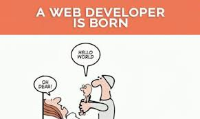

To make this new blog, I have had to learn a few basic things about web development. Lets just say that my knowledge about this stuff is rudimentary at best. Its like learning a whole god damn new language. I don't even know where to start. So I'm going to try and learn some web development while also blogging about it. #SO_META

LET US BEGIN: To get this working, I've had to learn a little bit about github, markdown and gatsby. I'm going to try and explain what each of these tools does. 

**Git**: is a tool that tracks changes you make to your code. Its like a "version maker". Each time you "git" something, it creates a new version and tracks the changes. That way, if you want to go back to your old code that you erased for example, there is always a previous version of you code you can revert to. 

**GitHub**: basically a way to sync the code you are working on your computer with a copy hosted on a GitHub server. So for example  - if you are making a blog or website, you can have the blog domain extract and run the code from the github repository to display on the blog's URL and voila - you have a WEBSITE!

Terminal Commands to know to be able to use GitHub

1. *cd* (followed by directory name): go into a new directory

2. *cd..* : go backwards in a directory

3. *ls* : lists all files in the current directory

4. *git clone* (followed by link that can be found in the github website): takes all the files that were created on the Github repository you made on the github website and copies them onto the folder in your computer

5. *git status* : Tells you what is different in your local github folder vs what is on the Github respository

6. *git add* (insert 'file name') : adds whatever file you added on your computer to the repository
    - git add .a : adds all files that were edited to be committed

7. *git commit* - m "added 'file name'" : commits / locks it into the repository and spits back the message after - m

8. *git push* : takes what you have committed and syncs it with github.com

9. *git pull* : pulls whats on github onto your local folder to be further edited (need to be in the folder in terminal before executing command)

10. *"Esc :wq"* : escape colon wq will help you get out of a full blown commit

Markdown is bascially a writing language that is easy to use and converts automatically into html. Here is some info on how to use it: https://ghost.org/changelog/markdown/

Gatsby is, to the best of my understanding an application that takes what you create in markdown and then turns it into a website. AMIRIGHT???

### SO THERE YOU HAVE IT! This bitch is making websites now! 

