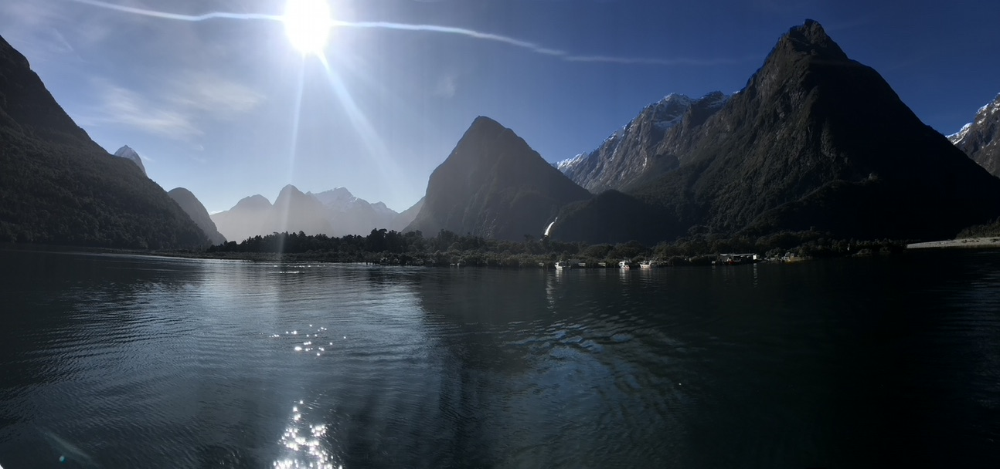
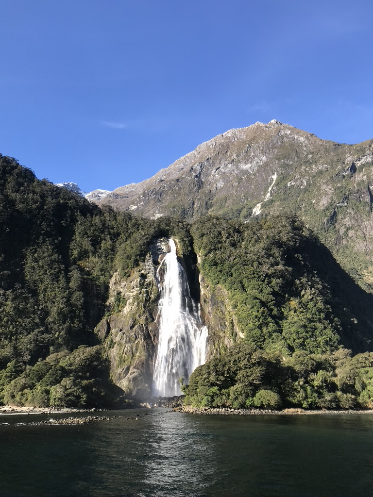
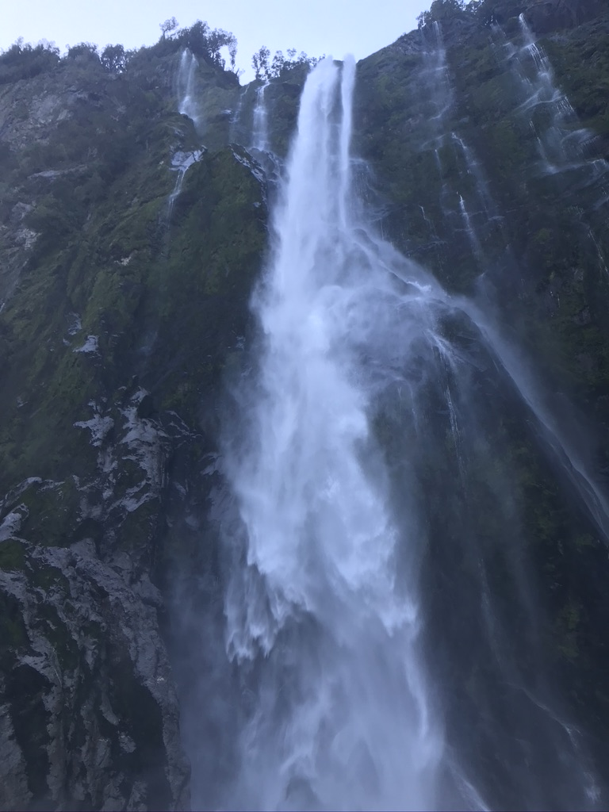
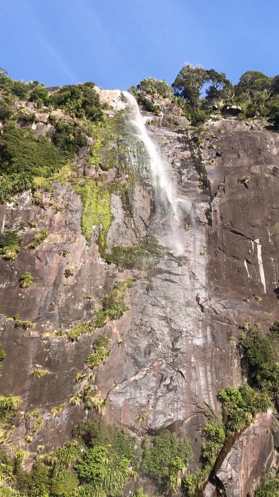

Ok to be honest, I had no idea what a sound even was before visiting Milford Sound. So I quickly looked it up on my way there from Queenstown only to learn once I arrived at my destination that Milford Sound wasn't even a sound. THEN WHAT THE HELL IS IT?? A NOISE?? ... Turns out Milford Sound is actually a Fjord. WTF is a fjord now?? and why is it spelled all weird? Apparently the reason Milford Sound is a fjord is because its valley was carved out by glaciers connecting to the sea rather than rivers. Um.. did we really need to invent an extra word to make that distinction???

Anyways, ON TO MILFORD SOUND!

The drive to Milford Sound itself, though somewhat arduous and windy, was incredibly beautiful. I was lucky to have even been able to visit this famous destination as I learned that the road to Milford Sound had just re-opened after being closed for months due to damage from recent rains and floods.  I had bought tickets for the "JUCY Cruise" the night before and was looking forward to seeing the fjord by boat. Unfortunately, as usual, I underestimated how long it was going to take for me to get to my destination and arrived at the ferry port just as the 11am cruise that I was supposed to board was leaving the dock. CRAP... I probably shouldn't have taken that 20 min poo break on the way here. Due to the lack of tourism, a majority of the ferries operating in the Milford Sound had shut down for the season. Thankfully, there was a smaller local ferry that was still operating and had some seats open. And the folks at JUCY were kind enough to coordinate with this smaller ferry company and transfer what I'd paid them to this ferry instead and I only had to pay the difference. HOW AWESOME IS THAT!!? There is absolutely no way that would've happened in the US or anywhere else for that matter! + 1 NZ! 

Milford Sound definitely lived up to the HYPE! This was one of the most beautiful places I've ever been to. I mean god damn... what an incredible landscape. We slowly made our way down this clear green aqueous channel surrounded by towering granite on all sides. Here there were large trees growing out of sheer rock in the most improbable of ways. Back home,  I can't get even a damn cactus to grow in a pot. Also, waterfalls.... waterfalls EVERYWHERE!!! Apparently, due to the fact that there is no top-soil on the surfaces of these large granite mountains, when it rains, the water just pours out over the cliffs into the sound. On particularly rainy days, there can be thousands of waterfalls pouring down the walls of the sounds. What a crazy site that must be!! The cruise was one of the highlights of my sound island adventure and Milford Sound is definitely one of those places that I'll never forget! 

DOPE!

