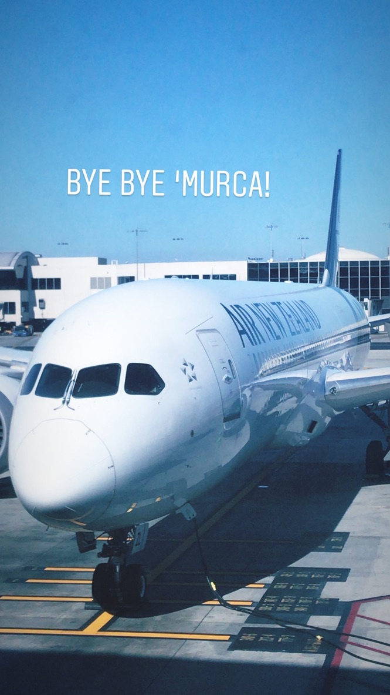

### Bye Bye America!

I applied for this job back in December 2019, well before the COVID-19 pandemic took hold in the United States. I had always mused about working in New Zealand or another country, and saw the perfect opportunity to pursue this dream while I still had little tying me down towards the end of residency. I applied through a locums company and actually ended up getting an ER position in a hospital in Hawke's Bay on the north island, which is apparently their wine country! I will be living in a little art deco inspired beach town called Napier (see red dot) which apparently has the same weather as San Diego!

Looking back, this was probably one of the best decisions I could have made. Not only does it give me the opportunity to work and travel in a country I have never been to previously, but as of today, New Zealand has officially ERADICATED COVID-19! You know what that means right?? NO MORE MASKS WOOHOOO!! Meanwhile, the US is imploding with COVID rates spiking throughout the entire country. Our cheeto-in-chief has only made things worse by politicising something as basic and self-explanatory as the wearing of a mask to prevent virus transmission. Having been an ER resident through the intial COVID spike, I can say that I am definitely not going to miss having to wear an N-95 mask and PPE every day for up to 10 hours at a time.

My contract actually doesn’t start till August 24th. However, before I can get up to shenanigans, I need to quarantine myself in Auckland as mandated by the NZ government. The plan will be to leave for NZ in mid july and finish my 2 week quarantine by the end of the month. That way, I will have an entire three weeks to find myself a little campervan and travel the country before starting work. 

#### Let the adventure begin! 

