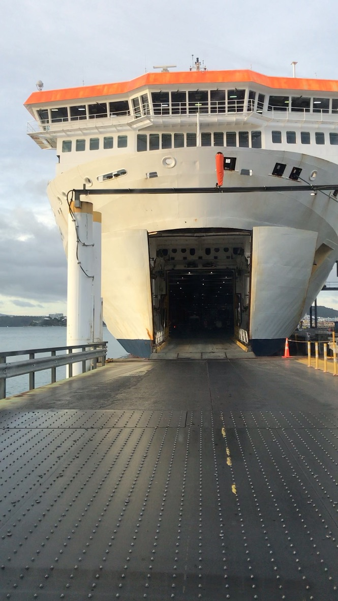
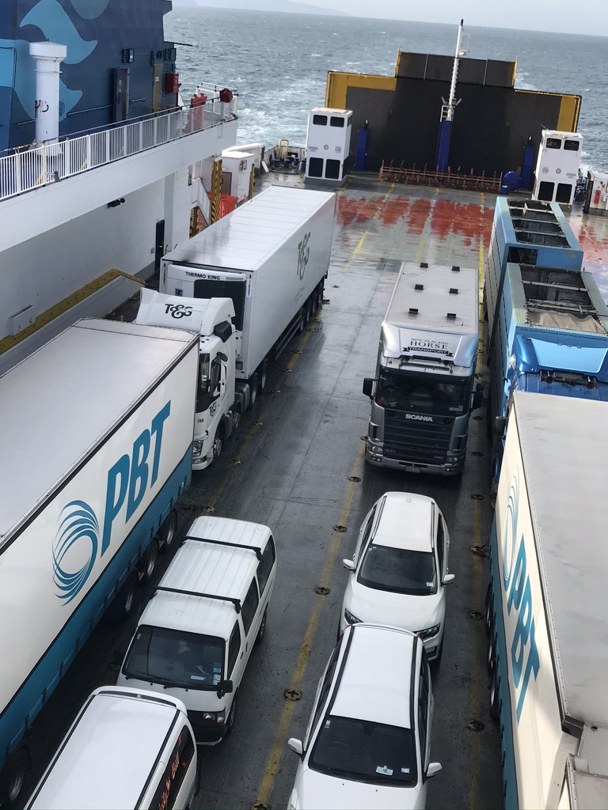
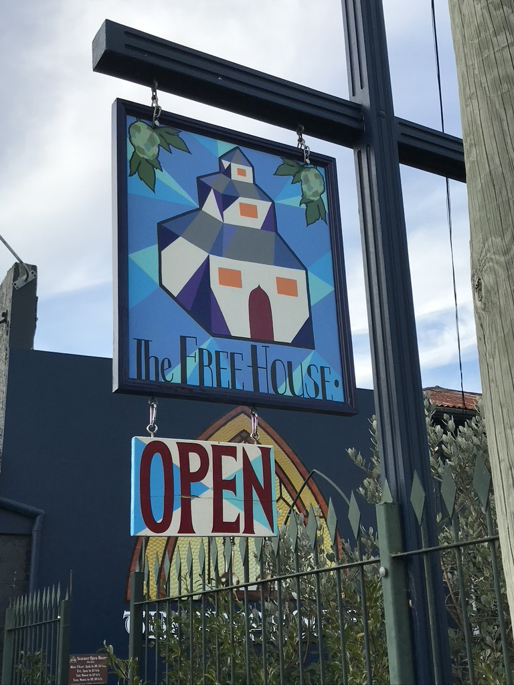
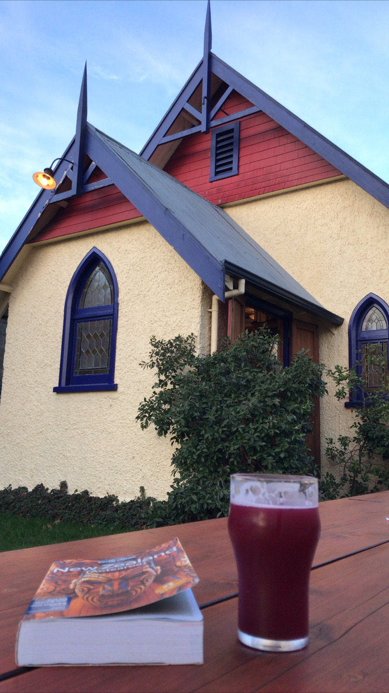

Somehow, despite giving myself ample time to make it to the 9am ferry over to the South Island the next morning, I still managed to be the last person to enter the Interislander Ferry. The ferry ride itself proivded some stunning views of the Marlborough sounds as the boat slowly weaved its way through the channels to dock in Picton, a town at the very northern tip of the South Island. Once off the ferry and after fueling up, I was able to make my way to Nelson, a cute little town at the heart of Malborough County, home to some of NZ’s finest vineyards. 

The highlight of Nelson was “The Free House”, a super cute ?1920s church turned beer bar that served up a variety of delicious local brews. It was here that I found one of my favorite beers in NZ - Duncan’s Blueberry Ripple Imperial Icecream Sour. This 8.2% ABV mouthful is hands down one of the most unique and delicious beers I have ever had! It was also here that I made my first ever kiwi friends! With a pint of this delicious creamy looking purplish-blue beer in hand, I had just plopped myself onto a bench outside the church and was starting to peruse my Lonely Planet NZ guidebook when I noticed the couple at the very end of the table eyeing me with a somewhat puzzled looking on their faces. “Hey… can I ask you something?”, said the lady as we made eye contact. “Are… you a REAL tourist??”. “Umm.. I think so?". “You are the talk of the bar mate! We haven’t seen an actual real live international tourist here in weeks!”. It turns out that I was one of first international tourists to visit this place since NZ had closed its doors to international travel due to the coronavirus. With COVID-19 spreading rapidly through the world and many countries closing off their borders, many of the remaining international tourists in NZ had apparently franticly booked it back to their home countries. These days, Nelson, like many other smaller towns in the South Island that were up until recently packed with tourists, gets almost no international traffic. 

My soon to be new friends Rebecca and Pannett hollered me over and we quickly got to knowing each other over some delicious brews. Turns out they were travelers as well, albeit the local variety, and were both friends from Wellington who were taking a brief little vacation from work to do a 2 week trip around the South Island. We ended up exchanging numbers before I left. Little did I know that I would actually end up running into them multiple times over the next few weeks, sometimes on accident, and others by design. 

WOOHOO TO NEW FRIENDS !! 

