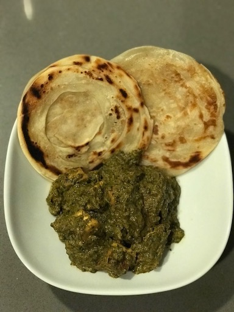

Found a recipe for "spinach tofu curry" on yummly only to realize 1/2 way through making it that is basically palaak panenr with tofu instead of paneer. The recipe is a little different from how I've made it in the past and tbh it came out pretty damnn awesome!!!! 

The recipe I used can be found [here](https://veenaazmanov.com/spinach-tofu-curry/?utm_campaign=yummly&utm_medium=yummly&utm_source=yummly)

Here is the recipe (we tweaked a few things)

### Ingredients 
1. 1/2 block tofu (cut into cubes)
2. 4 cups spinach (chopped)
3. 2 tsp cooking oil
4. 1/2 cup onions (1 small chopped finely)
5. 1 tsp garlic (minced)
6. 1 tsp ginger (grated)
7. 1 tbsp tomato paste
8. 2 tbsp curry powder
9. 1 tbsp garam masala
10. 1/2 tsp salt
11. 1/4 tsp pepper
12. 1/2 cup yogurt (plain)
13. 1 tbsp lemon juice
14. 1/2 cup cilantro (chopped)

### Recipe

Start off by frying the tofu until browned. You can also choose not to fry it if you want but fried tofu is my fav! 

Next heat the oil on your pan and cook the onions until translucent. 
Add garlic and ginger and saute for 1 minute
Then add the tomato paste followed by curry powder/garam masala
Saute for a few minutes (you can add a few tbsp of water to prevent spices from burning)
Once everything is cooked, transfer it to a food processor/blender along with the spinach and blend until smooth
Add back into pan and season w/ salt, pepper and lemon juice
Bring to slight boil and cook the spinach
Reduce to simmer and add yoghurt 
Add tofu to the mix

I ate it with malabar paratha I got at Trader Joes. 

PAw POW PAw

