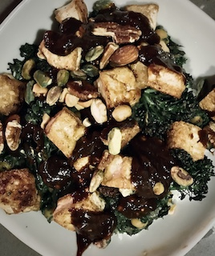

Those who know me well know that I am a HUGE peanut butter fan. Its become a staple ingredient of my daily morning granola breakfasts. Its no surprise then that I had to try this recipe out when I came across it. Belhold the PEANUT TOFU BUDDHA BOWL!

The recipe I used can be found [here](https://www.yummly.com/recipe/Peanut-Tofu-Buddha-Bowl-2077582#directions)

We tweaked quite a lot of the recipe. I wasn't a big fan of eating uncooked spinach or garbanzo beans. So we decided to blend the spinach and cook it instead

### Ingredients 
1. 1-2 cups spinach (blended)
2. 1/2 Onion
3. 1/2 cup garbanzo beans
4. 2 cloves of garlic (smashed)
5. 1/2 Block Firm Tofu
6. 1 cup broccolini

##### _Peanut Sauce_ 
1. 1/4 cup soy sauce
2. 1/4 cup peanut butter (crunchy)
3. 1/4 cup maple syrup
4. 2 tsp sesame oil
5. 3 tsp garlic chilli sauce

### Recipe

While frying up the tofu cubes (deep frying prefered), started frying up some onions. Once brownish/translucent, we added in garlic and blended spinach along with the garbanzo beans and let it cook for a 5 mins on medium. We also toasted the brocolini in the microwave oven at 400 degrees till they were brown and crisp

The sauce was made but mixing all the ingredients above. It honestly came out a LOT darker than what it looks like in the picture and sweeter than I would've liked it but it was muy delicious after we added some extra chilli sauce.

Once everything is cooked, you bascially just add the spinach/garbanzo saute to a base of rice followed by tofu and brocollini and top it off with the tofu, broccolini, and nuts/sriricha to taste and BAM - PEANUT TOFU BUDDHA BOWL! 

mmmm... tastes sooo gooooddddd

