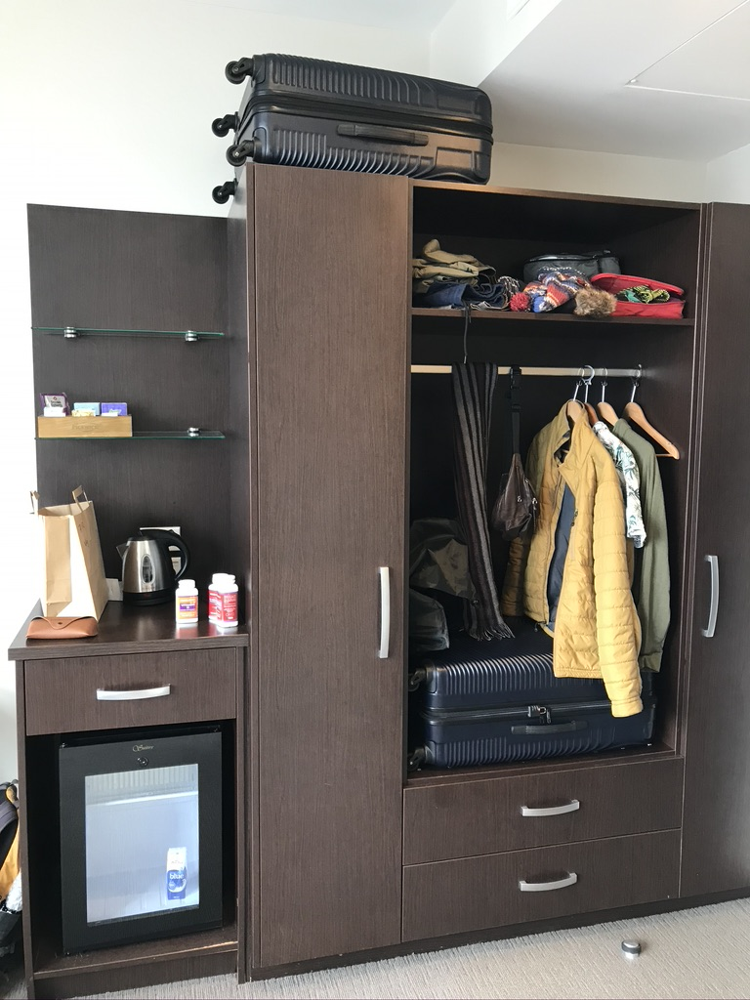
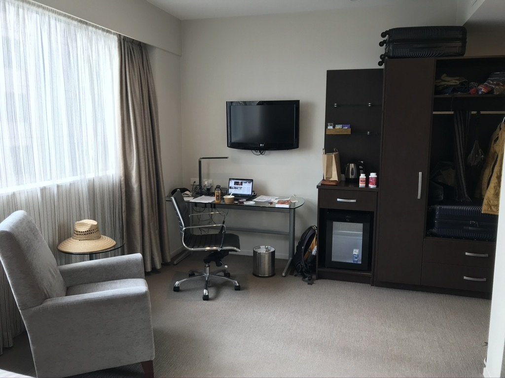
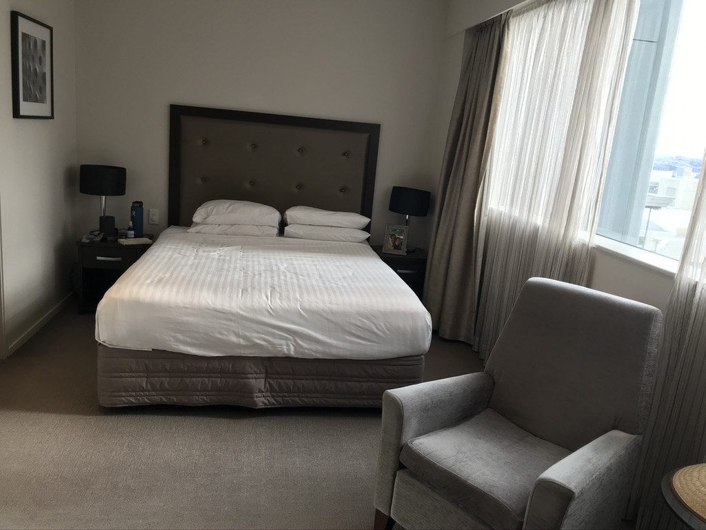
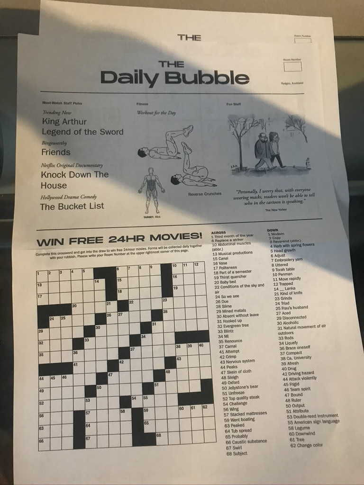
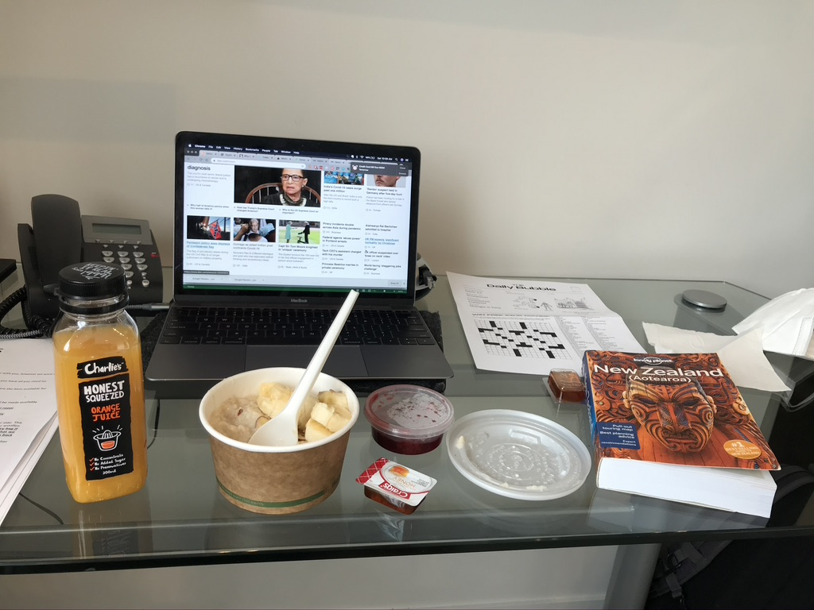
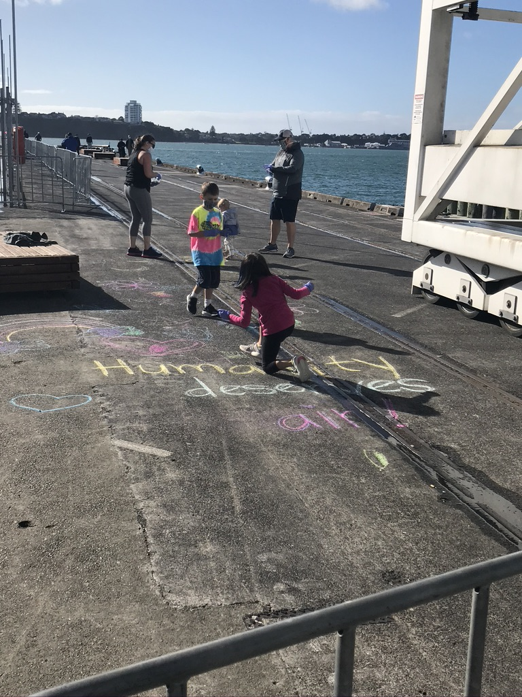

### Bye Bye America!

I applied for this job back in December 2019, well before the COVID-19 pandemic took hold in the United States. I had always mused about working in NZ or another country after residency, and after Erika and I broke up, I saw the perfect opportunity to pursue this dream while I still had little tying me down. So I applied through a locum’s company and actually got the job. I will be working in Hawkes Bay on the North Island and staying in a cute little Art Deco beach town called Napier. 

My contract actually doesn’t start till August 24th, but before I can get up to shenanigans, I need to quarantine myself in Auckland as mandated by the NZ government. The entire journey thus far has been so incredibly smooth. The flight into Auckland was eerily empty, despite it being the only flight out of the United States to NZ for the month. I had the entire exit row seat to myself and got to watch Wonder Woman for the first time. What a dope movie. I can’t believe I haven’t seen it yet. And Gal Godat is spectacular in it. 

### Arrival in New Zealand

Upon arrival in Auckland, you  are screened at immigration and your risk level is determined. Based on the fact that I had no symptoms, exposures and I had had a negative COVID-19 test just 10 days ago, I was deemed to be low risk and placed in “managed-isolation”. Once screened, you are taken by bus to a hotel where you begin your 14 day isolation. I was posted at the Rydges Hotel in downtown Auckland. Just for kicks, I looked up the hotel on google and turns out its a 4-star hotel that normally charges around $350 USD/night. DAMN DAWGGG!! 

On entering the hotel,  a person from the ministry of health goes over ground rules with you prior to you getting checked in. These include: 
* Always where a mask whenever you are outside your room. 
* No physical interaction with people outside of your immediate bubble/family 
* No leaving the facility for 14 days     

### The Quarantine Experience

The folks at the ministry of health have really done a lot to help make our stay as comfortable as possible given the circumstances. The rooms are clean, spacious and modern. Every morning, you are delivered breakfast to your door along with a little newsletter they have put together called the “Daily Bubble”. This little newsletter contains crossword puzzles, sudoku challenges, movie/TV show recommendations, comics and other tidbits to help keep you busy during your stay. In addition to breakfast, you are also served a morning snack around 10 am followed by lunch, an evening snack and dinner. Thats so much food!! You are more likely to have to be rolled out of the facility at the end of your 14 days than you are to go hungry. They even have a full vegetarian menu. 

Given that managed isolation is less restrictive than a full quarantine, folks are allowed to leave their room, provided that they wear a mask. Several activities are available to guests including social distancing yoga and light-workout classes in the activity room of the hotel. These ‘classes’ are basically YouTube videos that are turned on at specific times and projected onto a screen in the activity room. Participants are given towels to use as mats. If you fancy a run, you can sign up to do sprints on the loading ramp at the back of the hotel. Your need for fresh air can be satisfied through a couple different options. One can either sign up to spend some time on the rooftop patio or go for an “outdoor walk”. Those who sign up for the walk are shuttled to a pier by the water that is fenced off, where guests can walk up and down to get some steps in while enjoying the sunlight. You of course have to wear a mask the whole time for any and all of these activities. 

During this time, your health is also constantly being monitored. Every day, you get a visit from a nurse who asks you about your symptoms and checks your temperature. You also get a COVID test on day 3 and day 11 of your stay. If you are positive or start showing symptoms, you are immediately transported to the quarantine facility which manages higher risk / covid+ guests. You are also given a call daily by hotel staff asking if you are feeling ok from a mental health standpoint and if they can do anything to help make your stay enjoyable. They even do two loads of laundry for you doing your stay. Staff overall do their best to minimize contact with you so all supplies are left at the doorstep with a knock on the door. 

And did I mention all of this is FREE??? WOW. Talk about hospitality. Damn these Kiwis be flexing HARD! Imagine if you were quarantined by the government in the US - you would probably get placed in some damp warehouse, waterboarded, told to shut up and fed pet food. They would also probably only use rectal swabs, just to make your stay is extra unpleasant, unless thats your thing, in which case... BONUS! 

### The Daily Routine

I was quick to develop a nice little daily routine which grew to love. This involved getting up at about 6 am and listening to the morning news followed by two of my favorite little podcasts (NPR's Make Me Smart and Robinhood Snacks Daily) while eating breakfast. At 9 am, it was time for morning yoga and a shower. Late morning was for doing some necessary medicine reading to keep my brain still ticking followed by logistics/adventure planning in the afternoon. Around 3 pm, I'd do a little body weight workout in the hotel room and then meet up with a couple other physicians who were also in quarantine up at the rooftop where I'd catch some rays and get my daily dose of human interaction. As evening rolled around, I'd maybe facetime some friends and loved ones, watch some netflix with dinner and eventually retreat to the bed with a book (current book - Anatomy of Hope by Jerome Groopman). 

### Final Thoughts

Overall, I am incredibly impressed by lengths the NZ government has gone through to make our stay here as comfortable as possible. I feel like they understand that having to quarantine/isolate upon coming to the country is an inconvenience to many and do their best to mitigate as much of that as possible, despite not really having to do so. The government here seems to take pride in taking care of its citizens, a concept many would argue is pretty foreign in other countries, including the United States. If NZ can make even quarantine a great experience, I can not wait to see what else this country has in store for me as I begin my year long adventure! 

Update: Apparently the NZ government is planning on charging folks $3000 for their quarantine stay rather than have the taxpayers shoulder this burden. Phew, thank god I squeaked through just in time! 

