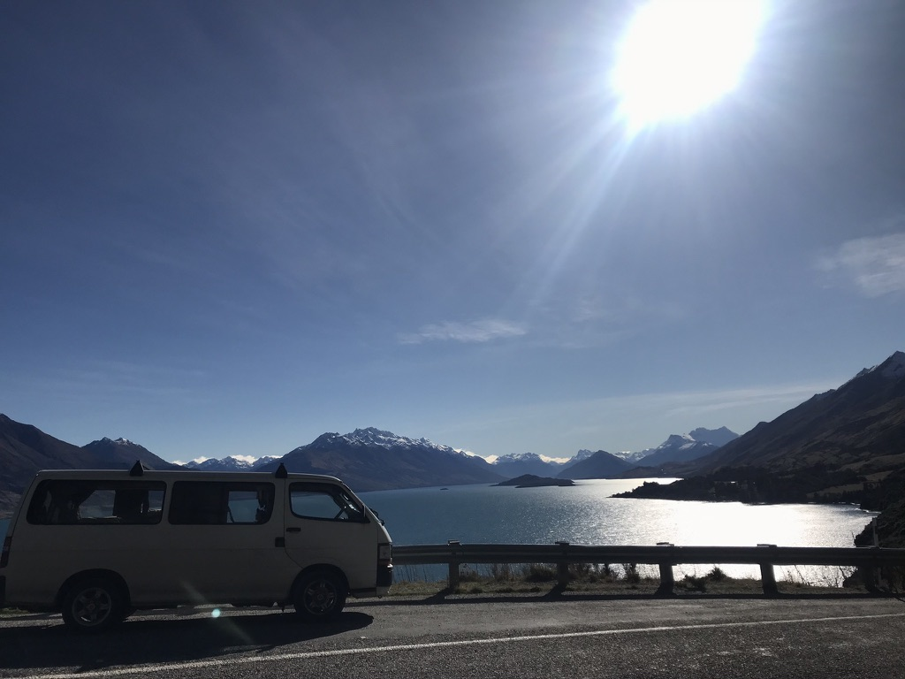
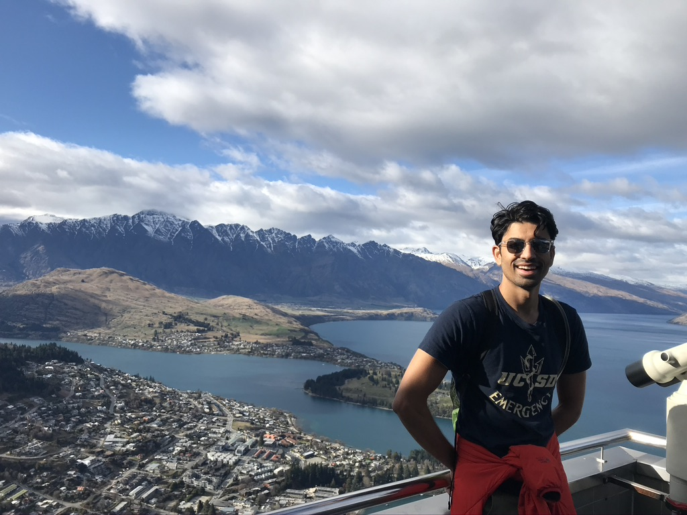

I'd heard a lot about Queenstown, New Zealand's adventure capital, as I made my way down the south island. Usually, people were in one of two camps. Many LOVED the action, diversity and bustle of what has now become one of the worlds biggest international tourist hotspots. Others lament that the once idyllic town has become a commercial shell of its former self, with housing prices soaring due to international real estate investment, making Queenstown largely feel unaffordable and unwelcome to the local population. 

I drove into Queenstown on a beautiful sunny day. You could see the entire town reflected on the lake it bordered, with hugh snow capped mountains as a backdrop. It was like something out of a postcard! JEEBUS - who ever thought of building a town here was a GENIUS. There was incredible beauty in every direction you looked! 

To get a better lay of the land, I decided to take a little steep hike up the "Tiki Trail" to a well known view point. This hike, while just as steep as the Roy's Peak hike in Wanaka, was much shorter in distance. One can also take a $70 gondola ride up to the view point, but I preferred the hike - got a good workout and saved some $$$ (beer money for later). The hike ended at a dope little cafe on top of a hill. It was also the starting point for a zip-lining course and a ?luge course. I had no idea what a luge was but apparently its a downhill track where one can drive little toy cars down at high speeds - so basically downhill gocarting. GOT IT! The Cafe had a panoramic balcony that offered SUPER DOPE views of the either town, lake and the mountains that surrounded it. It was a perfect way to start of the day! I got a little coffee up top, enjoyed the views, snapped some pics and slowly made my way down. By this time, I had worked up a nice little appetite. My lonely planet guide directed me to a yum little burger/sandwich joint called Fergberger. It was a small shop that was surprisingly crowded, though I was able to get my falafel sandwich pretty fast. I would later find out that Fergberger is one of those spots that normally has huge lines out the door and one often has to way almost an hour to get their food on a normal day. But thanks to the pandemic and precipitous drop in tourism, there was barely any line this time around. SCORE! 

Through some of the pics I had posted on instagram, my friends Ricky and Lis from back in SD were able to ascertain that I was in Queenstown, and they sent me a message offering to connect me with some of there friends in town. At this point, it had been some time since I'd really hung out with anyone, so I eagerly accepted the offer to be introduced to some locals. Ricky and Lis put me in touch with Jess and Jarod, this adorable couple who had made Queenstown their home. Jess and Jarod met up up for beers at this cute little bar called Perky's. Perky's is a bar located on a boat thats permanently docked at the port. With beers in hand, I got to learn a bit about my new friends. Jess is British and works in marketing while Jarod used to run a winery tour shuttle service, but had to shut it down because of the lack of tourism due to covid. In fact, I hear that the Queenstown economy has taken a major it its primary industry is tourism.  Those, like Jarod who have lost their jobs have thankfully been financially supported by the government till the industry has a chance to recover. Jarod was able to use this money to sign up for online classes to learn more about the wine industry and the various jobs related to it. 

Jess and Jarod were kind enough to offer me their guest bedroom for the night which I gladly accepted, especially since it was a bit chilly outside and I hadn't taken a shower in DAYS. Ahhh.... warmmm showerssss. How I miss youuuuu. That night, I went and played musical bingo at a bar with some of their friends. My first real NZ bar experience!! We actually ended up winning a couple free drinks too! 

I also ended spending the next evening with my new found friends and joined them for a standup comedy show at this cool bar called Yonder. Their friend who we played bingo with the previous night was actually the host of the show! Super COOL! There were so many people at this bar! At first I was a bit uneasy because I don't think I had been to a place this crowded since before the pandemic! I feel so lucky and thankful to be somewhere where there is no covid. 

All in all, I ended up having a great time in Queenstown - both because of beautiful landscape and because the wonderful company! Jarod will be coming up to Hawkes Bay for a class in a few weeks so I look forward to return the favor for the wonderful hospitality they have provided me with. 

Next Stop - MILFORD SOUND!