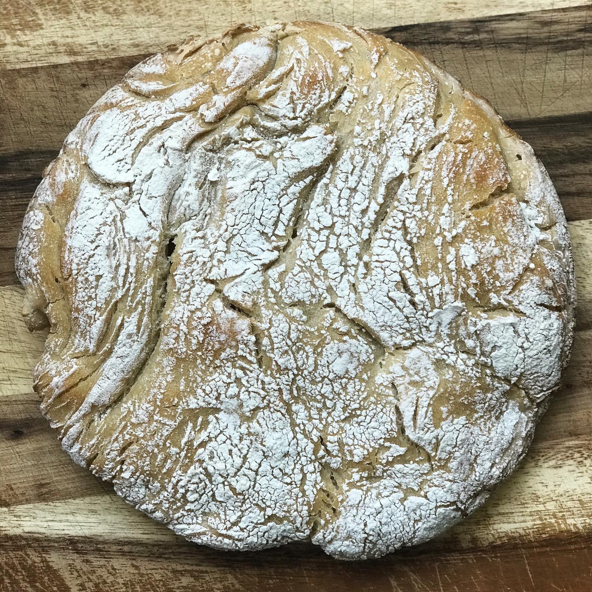

So, being the basic bitch I am, I decided to take inspiration from many of the other folks trying out bread making during and give a go at making sourdough bread. Now mind you, I haven't baked ANYTHING ever so it probably wasn't the smartest idea to pop my baking cherry with sourdough bread but I felt like I was up for the challenge. 

I got some sourdough starter from one of my attendings and fed it the night before with some flower and water prior to using it the next day.

The recipe I used can be found [here](https://www.thekitchn.com/how-to-make-sourdough-bread-224367). It was basically the first link when I googled "sourdough recipe"
I also watched this [video] from a youtube channel called "Basics with Babish". He puts together some high quality cooking videos and also dives into a lot of fun random interesting subjects/hobbies. The video gave me good tips the technique aspect of sourdough baking. 

Spoiler: My bread ended up looking nothing like what a sourdough loaf should but I'm still super proud of my deformed little baby. 

Here is the recipe 

### Starter

Got the starter from Erin Noste, one of my attendings. Its basically a combo of yeast, water and flour and needs to be fed on a regular basis to stay alive. If stored in the refrigerator, the starter only has to be fed 1-2x/week. If kept outside, it needs to be fed 1-2x/day. When using refrigerated starter, you need to take it out of the fridge and feed it 3x at room temp to get it to come alive again before actually using it to bake bread.

### Ingredients
- 4 oz starter (1/2 cup)
- 1/2 cup lukewarm water
- 1 cup all purpose flour

Keep only 4 oz of your starter and discard the rest, add the water and flower and mix. Let sit for a couple hours before refrigerating if possible. 

More info on sourdough starter [here](https://www.kingarthurflour.com/recipes/feeding-and-maintaining-your-sourdough-starter-recipe)

If you need ideas on what to do with your discarded starter, you can find them [here](https://www.kingarthurflour.com/recipes/collections/sourdough-discard-recipes)

### Levain

#### Ingredients 
- 1 tablespoon active sourdough starter
- 15 grams all-purpose flour or bread flour (1/2 cup)
- 75 grams water (1/3 cup)

I think one mistake I made was not making sure the sourdough starter was super active before using it. I basically just fed it the night before, put it in the fridge and used it for the levain the next day. In retrospect, I should've kept it outside and fed it daily for a few days before using it. 

To make the levain, I mixed all the ingredients above in a bowl and let it overnight. 

It did look like the levain had grown and there were some bubbles suggesting activity but not as much as I expected. 
I tried the "float test" where you take a little tsp of levain and put it in water and see if it floats. If it does, then its ready to be used. If not, it probably needs to be fed more or something. Mine didn't float but I was impatient and decided to go ahead with it anyways

### Autolyse

#### Ingredients
- 525 grams water (2 1/2 cups), divided
- 1 tablespoon salt
- 700 grams all-purpose flour or bread flour (5 1/2 cups)
Mix these in a small bowl and allow for salt to dissolve

Next mix the remaing water, flower and salt to the levain and mix it up. This apparently helps develop the gluten and the flower breakes down into sugars used up by the levain. Let this sit for about 30 mins - 4h

After this resting step, mix in the salt. Salt is necessary for a flavorful bread, but can also inhibit the activity during the autolyse step.

### Folding the Dough 

I basically followed the steps on the Basics with Babish video for the folding dough part. It basically involves folding the dough in several different ways and allowing it to rest for 30 mins or so between foldings till the dough goes from shaggy to smooth and tight 

### Dividing the Dough 

Not sure why you're supposed to devide the dough. I assume its because the amouth of dough you now have is too much for a single loaf. This part basically involves dumping the dough upside down on a floured surface and splitting it in two with a pastry scraper. You cna then reshape it in to little rounds by slipping your pastry scraper under the edge of the dough and then scraping it around curve of the dough, like turning left when driving. (see Babish video for more details). Let sit again for 30 mins 

### Shaping the Dough

I didn't have a proofing basket so I just used a bowl which didn't work out too great. ( i also forgot to line the bowel with a kitchen towel. What you are supposed to do is line the bottom of a proofing basket or bowl with a kitchen towel, cover it would more flour than you think you will need. 

Pour flour onto the top of your dough and flip it upside down using the pastry scraper. Fold the dough to create a butthole (see babish video). After this, transfer it into the proofing basket upside down. Either cover thinly with a wrap or plastic bag and leave it for 3-4h or overnight in the fridge 

### Baking the Bread

Set oven to 500 degrees with empty dutch oven in it
Flour the base of a dutch over and Transfer contents of bread basket into it. 
Score the bread by making a 2-3 inch slit on the top with a blade at 45 degree angle 

Bake for 20 mins
Turn temp down to 450 degrees and bake another 10 mins
Remove lid and continue baking for 10-15 mins until crust is golden brown (just short of burnt)
Transfer to a wire rack and allow to cool completely (about 30 mins) before slicing. 

THERE YOU HAVE IT! VISHNU'S FIRST BAKING DELUX EXTRAVAGANZA!!!!! I'm just proud I didn't destroy anything or burn myself. #WIN

