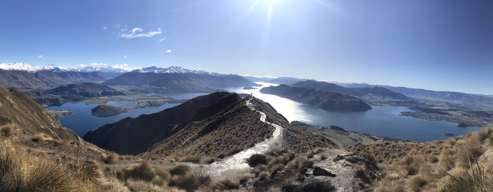

If I had to pick a favorite town on the South Island, it would be Wanaka. A cute little town at the edge of a picturesque lake surrounded by snow capped peaks, Wanaka offers the visitor a little bit of everything: 

You want peace and quiet? - Take a walk along the lakeside and check out #ThatWanakaTree, a lone tree growing out from the water several feet into the lake. Or grab a little snack or beer at one of the many cafes overlooking the water. 

Want to burn some calories? - Take a hike up Roy’s Peak. OH MY GAWD I was not prepared for this hike. I remember reading that it was an uphill journey but Jesus Christ thats an understatement. The hike was sheer vertical and went up over 4000ft in a span of 2 hours! It JUST WOULDN’T END… till it did. And thankfully the views from the top were absolutely worth the effort it took to get there. From the top, one can see the beautiful Southern Alps and all the little lakes that dotted its base. Having finished the gruling uphill hike, I was looking forward to cruising downhill. But alas, the way back also proved to be a grind, albeit for different reasons. While it was easier on the lungs and heart, the steep decline beat the crap out of my old-man knees. All in all, Roy’s peak was a DOPE hike and I’m glad I did it. I’d definitely do it again if I were to come back. At least this time I’ll know what to expect. Though… I wonder whether I was better off  not knowing how intense it was going to be. 

Into adventure sports? - Chose from a long list of crazy life threatening shit to do including bungee jumping, sky diving, white water rafting, jet skiing, zip lining etc. I myself didn’t really partake any of these because 1. I value my life too much to be doing this shit. 2. I didn't want to exacerbate my lower back injury (insert old man groan) 3. My disability insurance doesn't cover injuries from jumping off a bridge or plane (probably for good reason). I still remember the time I saw a 16 year old in the ED who had fallen backwards while riding a jetski. The water jet from the jetski went right up her butt and ended up perforating her colon... Poor girl had to poop into a bag attached to her belly for months! PASS!

Overall Wanaka was one of my favorite little towns. I definitely liked it more than Queenstown, its older, louder, alcoholic cousin. 

